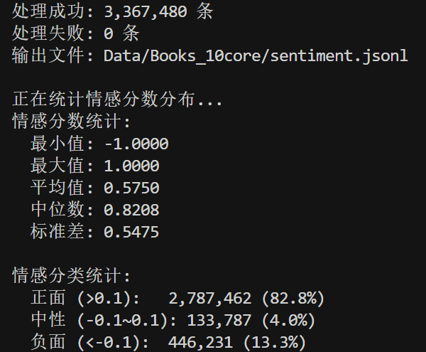
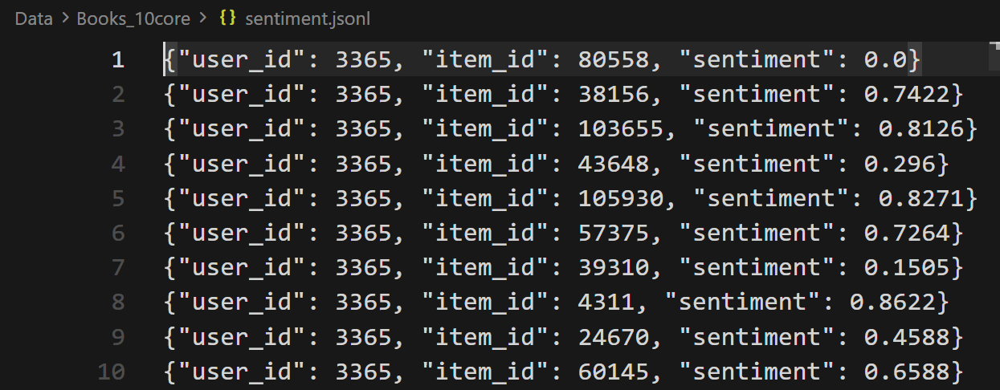
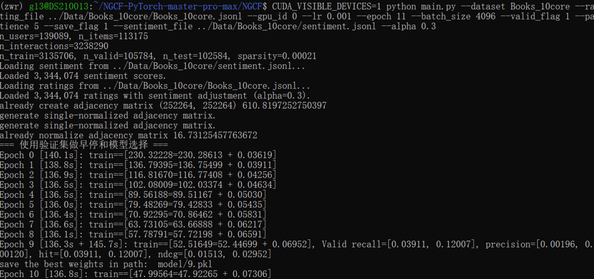
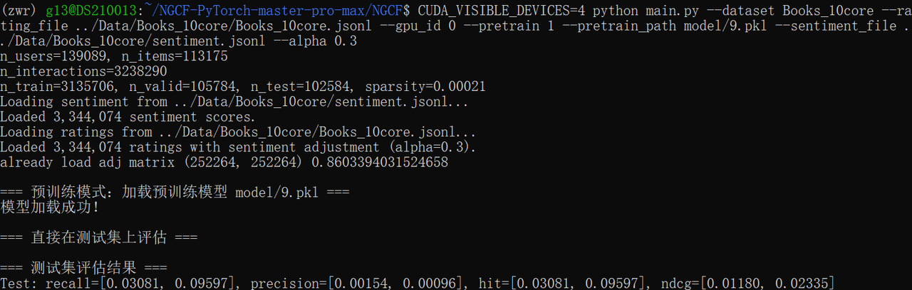

# Neural Graph Collaborative Filtering
This is my PyTorch implementation for the paper:

>Xiang Wang, Xiangnan He, Meng Wang, Fuli Feng, and Tat-Seng Chua (2019). Neural Graph Collaborative Filtering, [Paper in ACM DL](https://dl.acm.org/citation.cfm?doid=3331184.3331267) or [Paper in arXiv](https://arxiv.org/abs/1905.08108). In SIGIR'19, Paris, France, July 21-25, 2019.

The TensorFlow implementation can be found [here](<https://github.com/xiangwang1223/neural_graph_collaborative_filtering>).

And also referred to another implementation, which provide the main framework:

  https://github.com/huangtinglin/NGCF-PyTorch

New Pytorch version is used in these codes different from previous implementation.

# Amazon Reviews 2023 – Books (Filtered 10-Core)

This project is based on the **Amazon Reviews 2023 – Books 5-Core** dataset and applies additional preprocessing to reduce data scale and improve training efficiency.

Due to the extremely large number of samples in the original dataset and the resulting long training time, we perform the following filtering steps:

- Apply a **10-core filtering** strategy to retain users and items with sufficient interaction frequency
- **Remove image-related information** to focus solely on textual and structured review data
- Filter reviews with **helpful_vote > 0** to improve data quality and reliability

The resulting dataset is more compact and suitable for efficient training, analysis, and experimentation in recommendation systems and machine learning tasks.

## Dataset

Due to GitHub file size limitations, the dataset is **not included** in this repository.

The dataset is publicly available on Kaggle:

🔗 **Kaggle Dataset Link**  
https://www.kaggle.com/datasets/blackxz/amazon-review23-books10core

## Dataset Description

The dataset is a subset of Amazon customer reviews focusing on the **Books** category, filtered using a **10-core** criterion to ensure data quality and sparsity reduction.

It contains structured review information suitable for:
- Recommendation systems
- User behavior analysis
- Sentiment analysis
- Machine learning experiments

## How to Download the Dataset

### Option 1: Manual Download
1. Visit the Kaggle dataset page using the link above
2. Download the dataset
3. Extract the files locally

### Option 2: Kaggle API
```bash
kaggle datasets download -d blackxz/amazon-review23-books10core
```

## Running the Code

This section provides reference commands for training, evaluation, and pretraining using the processed **Books_10core** dataset.

### Training

```bash
python main.py --dataset Books_10core --rating_file ../Data/Books_10core/Books_10core.jsonl --gpu_id 0 --lr 0.001 --epoch 200 --batch_size 2048 --valid_flag 1 --patience 5 --save_flag 1 --sentiment_file ../Data/Books_10core/sentiment.jsonl --alpha 0.3
```
### Evaluation

```bash
python main.py --dataset Books_10core --rating_file ../Data/Books_10core/Books_10core.jsonl --gpu_id 0 --pretrain 1 --pretrain_path model/9.pkl --sentiment_file ../Data/Books_10core/sentiment.jsonl --alpha 0.3
```
### Pretraining

```bash
python main.py --dataset Books_10core --rating_file ../Data/Books_10core/Books_10core.jsonl --gpu_id 0 --lr 0.001 --pretrain 2 --pretrain_path model/9.pkl --epoch 200 --batch_size 2048 --valid_flag 1 --patience 5 --save_flag 1 --sentiment_file ../Data/Books_10core/sentiment.jsonl --alpha 0.3
```
Notes

rating_file specifies the processed Amazon Books 10-core review data.
sentiment_file provides auxiliary sentiment information.
pretrain flag:

0: standard training
1: evaluation
2: pretraining


alpha controls the contribution of sentiment information.

### 部分运行结果展示









